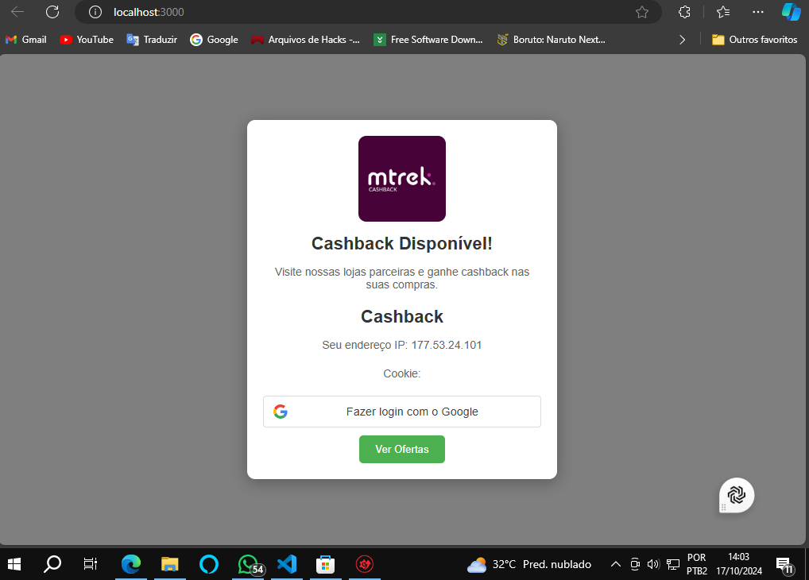

  <h1>Cashback Extension</h1>
    
Este é um projeto de uma extensão de cashback desenvolvida com <strong>React</strong> que permite que usuários recebam cashback em compras realizadas em lojas parceiras. A extensão é inspirada em sistemas de cashback como o Méliuz, permitindo fácil integração com diversas lojas e fornecendo uma interface amigável ao usuário.

 

 
  <h2>Como funciona</h2>
    
A extensão funciona como uma interface que exibe as lojas parceiras e o cashback disponível para o usuário. A lógica de cashback é calculada com base nas compras feitas nas lojas parceiras cadastradas, e o usuário pode ver as melhores opções diretamente através da interface.

   <h2>Tecnologias e Ferramentas Utilizadas</h2>
    <ul>
        <li><strong>React:</strong> Biblioteca JavaScript para construção de interfaces.</li>
        <li><strong>JavaScript (ES6+):</strong> Linguagem de programação principal do projeto.</li>
        <li><strong>React Hooks:</strong> Utilização de hooks como <code>useEffect</code> e <code>useState</code> para controlar o ciclo de vida e o estado dos componentes.</li>
        <li><strong>HTML5 & CSS3:</strong> Marcação e estilização da interface.</li>
        <li><strong>ESLint:</strong> Ferramenta de linting para manter a qualidade e padrão do código.</li>
        <li><strong>Create React App:</strong> Estrutura inicial usada para criar o projeto.</li>
    </ul>

   <h2>Como rodar o projeto localmente</h2>
    
Siga os passos abaixo para rodar o projeto em sua máquina local:

  <h3>1. Clonar o repositório</h3>
    <pre>
bash
git clone https://github.com/sucloudflare/extensao-cashback/tree/main
cd extensao-cashback
    </pre>

  <h3>2. Instalar as dependências</h3>
    
Para instalar as dependências do projeto, execute:

    <pre>
bash
npm install
    </pre>
    
Isso instalará todas as dependências listadas no <code>package.json</code>, como <code>react</code>, <code>react-dom</code>, entre outras.

   <h3>3. Executar o projeto em ambiente de desenvolvimento</h3>
    
Após instalar as dependências, você pode rodar o projeto localmente com o comando:

    <pre>
bash
npm start
    </pre>
    
Isso iniciará o servidor de desenvolvimento e você poderá acessar a extensão no navegador através do endereço:

    <pre>
http://localhost:3000
    </pre>

  <h3>4. Gerar a build para produção</h3>
    
Para gerar uma build otimizada para produção, utilize o comando:

    <pre>
bash
npm run build
    </pre>
    
A build será gerada na pasta <code>build/</code>, pronta para ser implantada em servidores estáticos ou em lojas de extensões de navegador.

   <h2>Estrutura de pastas</h2>
    
A estrutura principal do projeto é a seguinte:

    <pre>
.
├── public/               # Arquivos estáticos
├── src/                  # Código fonte do projeto
│   ├── components/       # Componentes React
│   │   ├── Cashback.js   # Componente principal de cashback
│   ├── App.js            # Componente de entrada da aplicação
│   ├── index.js          # Ponto de entrada principal
│   └── ...               # Outros arquivos de suporte
├── package.json          # Dependências e scripts do projeto
├── README.md             # Documentação do projeto
└── build/                # Build gerada para produção
    </pre>
    <h2>Principais Dependências</h2>
    
Aqui estão as principais dependências utilizadas no projeto:

    <ul>
        <li><strong>react:</strong> ^17.0.2</li>
        <li><strong>react-dom:</strong> ^17.0.2</li>
        <li><strong>eslint:</strong> Ferramenta para linting do código.</li>
        <li><strong>babel:</strong> Transpiler JavaScript para compatibilidade de código.</li>
        <li><strong>webpack:</strong> Empacotador de módulos para aplicações JavaScript.</li>
    </ul>
    <h3>Dependências de Desenvolvimento (DevDependencies)</h3>
    <ul>
        <li><strong>@babel/plugin-proposal-private-property-in-object:</strong> Plugin para suporte a propriedades privadas no Babel.</li>
        <li><strong>react-scripts:</strong> Scripts e configuração usada pelo Create React App para compilar, testar e gerar a build.</li>
    </ul>
    <h2>Como contribuir</h2>
    <ol>
        <li>Faça um fork do projeto.</li>
        <li>Crie uma branch para suas modificações (<code>git checkout -b minha-modificacao</code>).</li>
        <li>Faça commit das suas mudanças (<code>git commit -am 'Adiciona uma nova feature'</code>).</li>
        <li>Envie para a branch principal (<code>git push origin minha-modificacao</code>).</li>
        <li>Abra um Pull Request.</li>
    </ol>

<h1>Atualização</h1>

 <h1>Extensão de Cashback</h1>
  

    Este projeto é uma extensão de cashback que captura o endereço IP, cookies do usuário, e autenticação via conta Google para validar a elegibilidade ao cashback. O sistema consiste em um frontend desenvolvido em React e um backend em Node.js com Express, onde a validação da autenticação ocorre com base nos cookies, IP e token Google do usuário.
  

  <h2>Tecnologias Utilizadas</h2>
  <ul>
    <li><strong>Frontend:</strong> React, JavaScript</li>
    <li><strong>Backend:</strong> Node.js, Express, Cookie-Parser, Cors</li>
    <li><strong>Autenticação:</strong> OAuth2 Google</li>
    <li><strong>API Externa:</strong> ipify para captura do IP</li>
  </ul>

  <h2>Funcionalidades</h2>
  <ul>
    <li><strong>Captura do IP do Usuário:</strong> O frontend captura o IP usando a API pública do ipify.</li>
    <li><strong>Validação de Cookies:</strong> Cookies de sessão são armazenados e enviados ao backend para validação.</li>
    <li><strong>Autenticação via Google:</strong> O backend valida o token da conta Google, junto com o IP e os cookies, para determinar se o usuário está elegível para receber o cashback.</li>
  </ul>

  <h2>Estrutura do Projeto</h2>
  <pre>
    extensao-cashback/
    ├── backend/         # Backend em Node.js
    │   ├── node_modules/
    │   ├── package.json
    │   ├── server.js    # Servidor Express com autenticação por IP, cookies e conta Google
    ├── frontend/        # Frontend em React
    │   ├── public/
    │   ├── src/
    │   │   ├── components/
    │   │   │   ├── Cashback.js  # Componente que captura IP, cookies e autentica via Google
    ├── node_modules/
    ├── package.json
    └── README.md
  </pre>

  <h2>Instalação e Execução</h2>

  <h3>Requisitos</h3>
  <ul>
    <li>Node.js instalado</li>
    <li>NPM ou Yarn para gerenciamento de pacotes</li>
  </ul>

  <h3>Clonando o Repositório</h3>
  <pre>
    git clone https://github.com/seu-usuario/extensao-cashback.git
    cd extensao-cashback
  </pre>

  <h3>Configurando o Backend</h3>
  
Acesse o diretório do backend:

  <pre>
    cd back
  </pre>
  
Instale as dependências:

  <pre>
    npm install
  </pre>
  
Inicie o servidor backend:

  <pre>
    node server.js
  </pre>

  <h3>Configurando o Frontend</h3>
  
Acesse o diretório do frontend:

  <pre>
    cd front
  </pre>
  
Instale as dependências:

  <pre>
    npm install
  </pre>
  
Inicie o servidor frontend:

  <pre>
    npm start
  </pre>

  <h2>Testando o Projeto</h2>
  

    Ao iniciar o frontend, o componente <code>Cashback.js</code> irá capturar o endereço IP do usuário, o cookie de sessão, e também permitirá a autenticação via Google.
    Ao clicar no botão "Receber Cashback", esses dados serão enviados ao backend.
    O backend processa as informações (IP, cookies e token do Google) e retorna uma resposta com a elegibilidade ou não do usuário para receber o cashback.
  

  <h2>Considerações Finais</h2>
  

    <strong>Segurança:</strong> Para um ambiente de produção, recomenda-se o uso de HTTPS e uma autenticação ainda mais robusta, como OAuth2 completo ou JWT.
     
    <strong>Melhorias:</strong> A validação de IP, cookies e Google Auth pode ser aprimorada para ambientes com múltiplas camadas de segurança.
  

